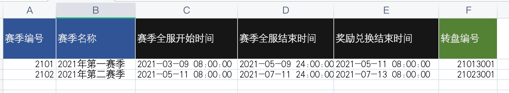
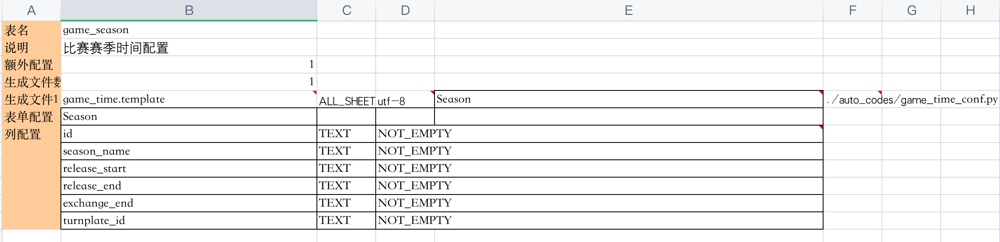

# xls2code功能介绍

excel文件自动转代码是游戏开发中一个重要的工具，一般而言，游戏策划都习惯于使用强大的excel来配置游戏数值、时间、奖励等常规配置，这部分配置最后会转化为代码被游戏程序引用使用。这个excel转代码的功能必须以自动化的形式进行，游戏策划只需按照一定规则填表，而游戏开发者则通过自动编表脚本自动生成对应的游戏配置代码。这里的xls2code项目解决的就是策划和游戏程序员之间的信息传递问题，游戏策划只需按照自己的想法填写excel,游戏程序拿到自动生成的代码配置直接引用使用即可，提升游戏开发的整体效率。


# excel转python文件的步骤
1. 填excel表，保存为后缀名为.xls文件
按需求填写excel表数据



.xls里建立CONFIG表，配置相关编表信息




2. 填写template代码模板，需要借助jinja2来完成代码的生成，该模板需要放在template文件夹内
```
################## 以下是自动生成的代码 ##################
## 比赛系统  lijunshi2015@163.com

TimeConf = { 
{{v.id}} : {
	"season_name"	: "{{v.season_name}}",
	"release_start"	: "{{v.release_start}}",
	"release_end"	: "{{v.release_end}}",
	"exchange_end"	: "{{v.exchange_end}}",
	"turnplate_id"	: {{v.turnplate_id}},
},
}

def get_conf():
	return TimeConf;


################## 以上是自动生成的代码 ##################

################## 以下是手工编写部分 ##################

```

3. 运行自动编表脚本，参数传入的是要处理的xls文件
```
python3 xls2code.py ./xls/game_season.xls
```
4. 最后会自动生成配置代码，放在auto_codes文件夹内
```


################## 以下是自动生成的代码 ##################
## 比赛系统  lijunshi2015@163.com

TimeConf = { 
2101 : {
	"season_name"	: "2021年第一赛季",
	"release_start"	: "2021-03-09 08:00:00",
	"release_end"	: "2021-05-09 24:00:00",
	"exchange_end"	: "2021-05-11 08:00:00",
	"turnplate_id"	: 21013001,
},
2102 : {
	"season_name"	: "2021年第二赛季",
	"release_start"	: "2021-05-11 08:00:00",
	"release_end"	: "2021-07-11 24:00:00",
	"exchange_end"	: "2021-07-13 08:00:00",
	"turnplate_id"	: 21023001,
},
}

def get_conf():
	return TimeConf;


################## 以上是自动生成的代码 ##################

################## 以下是手工编写部分 ##################

```

5. 自己的业务代码调用配置代码，例子是demo_main.py
```
import auto_codes.game_time_conf as time_conf

conf_time = time_conf.get_conf()
print(conf_time)
```

## # excel转cpp文件的步骤
编表工具理论上可以通过xls生成任何语言的代码，关键在于配置编写指定语言的template，比如我们这次要通过excel表生成C++的头文件，方便被引用，可以参考xls/game_season_cpp.xls和模板template/game_timne_cpp.template.使用xls2code.py脚本编出代码文件game_time_conf.h，最后再被业务文件include调用。请参考demo_main.cpp。

```
#include <iostream>
#include <map>
#include <stdio.h>
#include "auto_codes/game_time_conf.h"

using namespace std;

int main()
{

	std::map<int, std::map<string, string> > my_conf = get_conf();
	printf("%s\n", my_conf[2101]["season_name"].c_str());
	printf("%s\n", my_conf[2102]["release_start"].c_str());
    return 0;
}
```